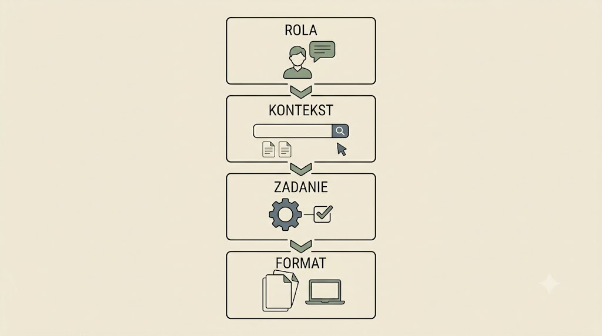
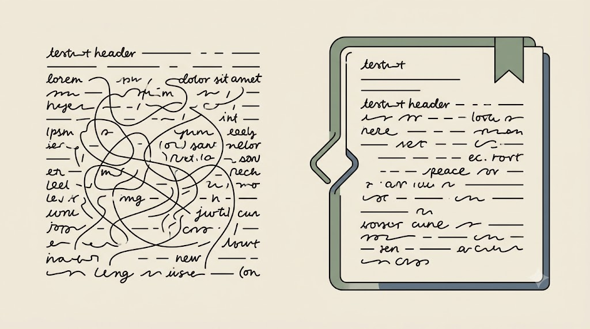

# Od zapytania do precyzyjnej instrukcji

Ta część jest o jednej rzeczy: jak rozmawiać z modelem tak, by dostać użyteczną, sprawdzalną odpowiedź. Zaczynamy od mapy narzędzi, przechodzimy przez budowę dobrego promptu, a kończymy na strukturze, która oddziela dane od polecenia. Kontrolą halucynacji i ochroną danych zajmiemy się w następnym rozdziale.

## Krajobraz narzędzi i zasada ograniczonego zaufania

Badacz, który nie odróżnia czatu od trybu *research* i od wyszukiwarki AI, zadaje właściwe pytanie niewłaściwemu narzędziu — i dostaje pewnie brzmiącą, niesprawdzalną odpowiedź. Zacznijmy więc od mapy.

- **Czat ogólny** (ChatGPT, Claude, Gemini, Grok) — odpowiada „z pamięci", domyślnie bez źródeł.
- **Tryb research / z przeglądaniem sieci** — dokłada aktualne wyszukiwanie i cytaty.
- **Wyszukiwarka AI** (Perplexity, Grok) — punktem ciężkości są odnośniki do źródeł.
- **Narzędzia literaturowe** (Elicit, Consensus, Scite) — pracują na bazach publikacji naukowych.
- **Agentowy deep research** — model planuje, wyszukuje wielokrotnie i składa raport.

<!-- ════════ GRAFIKA [G02] ════════
TYP: GENERATOR (diagram)
PLIK: images/g02-piec-narzedzi.png
PROMPT: "Diagram pięciu typów narzędzi AI od lewej (prosty czat) do prawej (agentowy deep research),
rosnąca złożoność, ikony zamiast tekstu, styl flat, paleta japandi: matowe kremowe tło #F1ECE3, akcenty szałwiowa zieleń #8A9A82 i błękit łupkowy #6B7B8C, atrament #26211C; bez gradientów i winiet, 16:9, bez napisów." -->

{fig-align="center" width="100%"}

Czym AI **nie jest**? Nie „wie" — przewiduje statystycznie prawdopodobny ciąg tokenów. To jedno zdanie wyjaśnia, dlaczego model potrafi zmyślić cytat brzmiący jak prawdziwy. Najmocniej widać to na żywo: poproś czat (bez przeglądania sieci) o pełny opis bibliograficzny „przełomowego artykułu" z wąskiej specjalności, a potem wklej podany DOI na [doi.org](https://doi.org). Zwykle trafisz na stronę błędu — model nie „skłamał", tylko *przewidział prawdopodobny ciąg tokenów* wyglądający jak cytat.

::: {.callout-warning title="Pułapka: błąd automatyzacji"}
Im płynniej i pewniej brzmi odpowiedź, tym mocniej usypia czujność — wynik przyjmujemy bez weryfikacji właśnie wtedy, gdy „wygląda profesjonalnie". To udokumentowany mechanizm zawierzania systemom automatycznym (*automation bias*). Lekarstwo: weryfikacja jako **odruch, nie wyjątek**, oraz pytanie „gdzie trafiają moje dane?" przy każdym narzędziu.
:::

::: {.callout-tip title="Ćwiczenie i artefakt"}
Zbuduj plik `00_mapa-narzedzi.md` z tabelą: *narzędzie · typ · do czego użyję · gdzie trafiają moje dane*. Zadaj **to samo** jawne pytanie badawcze trzem narzędziom (czat, tryb research, wyszukiwarka AI) i porównaj, czy odpowiedzi mają sprawdzalne źródła. Z odpowiedzi czatu wybierz jedno źródło i zweryfikuj je u źródła (DOI / Google Scholar / PubMed) — zapisz werdykt: istnieje czy zmyślone.
:::

> **Kluczowy wniosek.** Najpierw dobierz *typ* narzędzia do zadania; dopiero potem pisz prompt.

## Anatomia dobrego promptu: cztery warstwy

„Jedno zdanie i nadzieja" zawodzi, bo model dopowiada brakujący kontekst po swojemu. Anegdota z zespołu Applied AI Anthropic: pozbawiony kontekstu model na podstawie nazwy ulicy wywnioskował wypadek narciarski zamiast samochodowego. Lekarstwem jest struktura.

1. **Rola / ton** — kim jest model, jak mówi, że *nie zgaduje*.
2. **Kontekst i dane** — co musi widzieć (tylko materiał jawny lub zanonimizowany).
3. **Zadanie i kroki** — cel rozpisany na ponumerowane kroki.
4. **Format wyjścia i ograniczenia** — jak ma wyglądać odpowiedź i czego ma *nie* robić.

Prompt to **nauka iteracyjna i empiryczna** — idealną instrukcję buduje się krok po kroku, obserwując błędy. Informacje stałe (rola, format) oddzielamy od zmiennych (konkretne dane); to zalążek myślenia o prompcie systemowym.

<!-- ════════ GRAFIKA [G09] ════════
TYP: GENERATOR (diagram 4 warstw)
PLIK: images/g09-prompt-4-warstwy.png
PROMPT: "Diagram czterech paneli ułożonych jeden nad drugim: ROLA / KONTEKST / ZADANIE / FORMAT, każdy
jako cienko obrysowany prostokąt z małą ikoną. Minimalistyczna ilustracja edytorska, cienka precyzyjna
kreska, płaskie kolory, japandi. Tło jednolite matowe kremowe #F1ECE3, dużo pustej przestrzeni. Akcenty:
szałwiowa zieleń #8A9A82 i błękit łupkowy #6B7B8C, kreska w atramencie #26211C. Bez gradientów, winiet i
ostrych cieni, bez czytelnego tekstu. 16:9." -->

{fig-align="center" width="100%"}

Porównajmy dwie jakości tej samej prośby. Najpierw wersja, która zawodzi:

```text
streść metodologię tego artykułu
```

A teraz ta sama prośba w czterech warstwach:

```text
[ROLA] Jesteś recenzentem metodologii w naukach społecznych. Nie zgadujesz;
czego nie ma w materiale, oznaczasz jako „brak danych".
[KONTEKST] Analizuję sekcję metod artykułu jakościowego. Materiał:
"""
<wklejony, zanonimizowany fragment>
"""
[ZADANIE] 1) Wypisz projekt badania i dobór próby. 2) Wskaż 3 ryzyka trafności.
Przy każdym punkcie zacytuj zdanie, na którym się opierasz.
[FORMAT] Tabela Markdown: aspekt | ustalenie | cytat-kotwica. Maks. 200 słów.
```

Druga wersja zwraca strukturę, cytaty-kotwice i — co najważniejsze — przyznaje braki, zamiast je zmyślać.

::: {.callout-warning title="Warstwa kontekstu to punkt kontrolny, nie wrzutnia"}
Właśnie nauczyłeś się, że bogatszy kontekst daje lepszą odpowiedź — i ta sama zachęta popycha do wklejenia *surowego* materiału „żeby model miał pełny obraz". To najczęstsze miejsce wycieku w całym szkoleniu. Zanim cokolwiek trafi do warstwy kontekstu: zanonimizuj, zapytaj „czy do *tego* zadania naprawdę potrzebuję tych danych?" i nie wklejaj materiału wrażliwego do modelu chmurowego. Systematycznie zajmiemy się tym w następnym rozdziale.
:::

::: {.callout-tip title="Ćwiczenie i artefakt"}
Weź realne zadanie ze swojej pracy (materiał jawny). Napisz v1 jako jedno zdanie, przepisz do szablonu czterowarstwowego (`kurs-pe/szablony/szablon-promptu.md`), wykonaj dwie iteracje poprawek. Po każdej iteracji nazwij **jeden błąd modelu** i **warstwę, która go naprawia**. Artefakt: wypełniony szablon + dziennik iteracji v1→v3.
:::

## Markdown i XML jako struktura promptu

Gdy materiał do analizy **sam** zawiera nagłówki i listy, „płaski" tekst miesza dane z instrukcją. Struktura rozwiązuje ten problem na dwa sposoby.

- **Markdown** daje czytelną, lekką hierarchię: `#` nagłówki, `-` listy, bloki kodu. To **standard ery AI**: jeden prosty format, który równie dobrze czyta człowiek i model.
- **XML** daje twarde, nazwane granice bloków: `<material>…</material>`, `<zadanie>…</zadanie>`.

Spójrz, jak XML bezpiecznie odgradza dane od polecenia, nawet jeśli dane mają własne nagłówki:

```xml
<zadanie>Oceń metodę opisaną w materiale.</zadanie>
<material>
# Metoda
Badanie przeprowadzono w trzech etapach...
</material>
```

W wariancie czysto tekstowym model mógłby potraktować `# Metoda` jako kolejny nagłówek *Twojej* instrukcji. Znaczniki temu zapobiegają.

<!-- ════════ GRAFIKA [G20] ════════
TYP: GENERATOR (oddzielenie danych od instrukcji)
PLIK: images/g20-markdown-xml.png
PROMPT: "Oddzielenie danych od instrukcji. Po lewej płaski ciąg pomieszanego tekstu, w którym linia-nagłówek
niejednoznacznie zlewa się z otaczającymi liniami (zamieszanie). Po prawej ta sama treść zamknięta w wyraźnie
narysowanym, cienko obrysowanym kontenerze z abstrakcyjnym znacznikiem-nawiasem, tak że wnętrze jest widocznie
odgrodzone od instrukcji na zewnątrz (porządek). Styl flat, cienka precyzyjna kreska, paleta japandi: matowe
kremowe tło #F1ECE3, akcenty szałwiowa zieleń #8A9A82 i błękit łupkowy #6B7B8C, atrament #26211C; bez gradientów
i winiet, tekst jako abstrakcyjne kreski (nieczytelny), 16:9." -->

{fig-align="center" width="100%"}

::: {.callout-note title="Format dobieramy do złożoności, nie z mody"}
XML to nie magia. Krótkiemu, prostemu zadaniu dokłada tylko szumu — każdy znacznik to dodatkowe tokeny, a małe modele lokalne potrafi wręcz rozpraszać. Reguła: Markdown — gdy zależy na czytelności i materiał jest jednorodny; XML — gdy trzeba twardo rozdzielić wiele bloków (instrukcja + kilka cytatów + format) albo materiał ma własną strukturę.
:::

::: {.callout-tip title="Ćwiczenie i artefakt"}
Przepisz swój szablon promptu w dwóch wersjach — `prompt_md.md` i `prompt_xml.md` — i wklej w obie ten sam „trudny" fragment z własnymi nagłówkami (`kurs-pe/cwiczenie-formaty/trudny-cytat.md`). Sprawdź, w której wersji model pomylił nagłówek materiału z nagłówkiem Twojej instrukcji. Artefakt: ten sam prompt w dwóch formatach + dwa zdania „kiedy użyję którego".
:::

Umiemy już dobrać narzędzie i zbudować precyzyjny prompt. Pozostaje najtrudniejsze: jak rozpoznać, że model zmyśla, i jak nie wyrządzić sobie krzywdy danymi. To temat następnego rozdziału.
