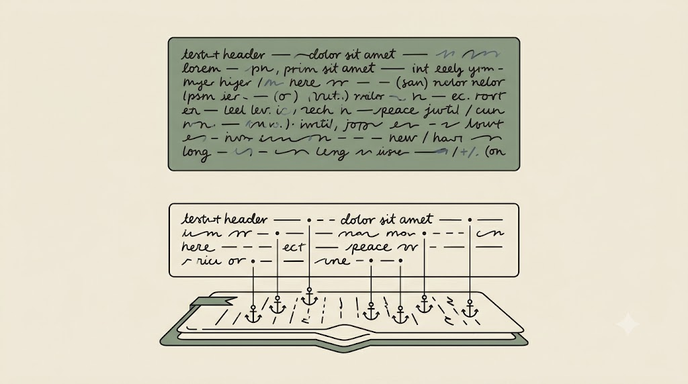

# Kontrola halucynacji i ochrona danych

Halucynacja brzmi *dokładnie tak samo pewnie* jak fakt — dlatego potrzebujemy metody jej wykrycia, a nie wyczucia. A skoro dobry prompt zachęca do podawania modelowi coraz więcej materiału, to właśnie tutaj zaczyna się ryzyko wycieku danych. Ten rozdział łączy dwie strony tej samej ostrożności: *zakotwicz* i *zapytaj, gdzie trafiają dane*.

## Zakotwiczenie wbudowane w prompt

Najprostsza metoda kontroli halucynacji to zakotwiczenie (*grounding*) zapisane wprost w instrukcji:

```text
Odpowiadaj wyłącznie na podstawie poniższego fragmentu.
Każdą tezę poprzyj dokładnym cytatem z fragmentu.
Czego nie ma w materiale — napisz „brak danych". Nie zgaduj, nie wymyślaj źródeł.
```

Różnica jest natychmiastowa. Bez zakotwiczenia, zapytany o coś, czego we fragmencie nie ma (np. „jaka była wielkość próby?" przy fragmencie bez sekcji metod), model **dopowiada prawdopodobną liczbę** — brzmi wiarygodnie, jest zmyślona. Z zakotwiczeniem odpowiada „brak danych". Nie chodzi o „lepszy" model, lecz o **instrukcję, która zabrania mu wymyślać**.

Drugą warstwą jest **weryfikacja krzyżowa u źródła**: DOI, PubMed, OpenAlex, Semantic Scholar. Żądanie cytatu-kotwicy i sprawdzenie próbki cytowań to dwa odruchy, które odróżniają ustalenie od ładnie sformatowanego zgadywania.

<!-- ════════ GRAFIKA [G21] ════════
TYP: GENERATOR (zakotwiczenie odpowiedzi)
PLIK: images/g21-zakotwiczenie.png
PROMPT: "Porównanie dwóch odpowiedzi jedna nad drugą. Górna: pewny, pełny blok tekstu, ale unoszący się
swobodnie, bez korzeni pod spodem (niezakotwiczona halucynacja). Dolna: krótszy blok tekstu z małą kotwicą
opuszczającą cienką linię w dół, do dokumentu źródłowego pod nim, wiążącą każdą tezę z materiałem. Sens:
zakotwiczenie — każda teza przypięta do podanego źródła. Styl flat, cienka precyzyjna kreska, paleta japandi:
matowe kremowe tło #F1ECE3, akcenty szałwiowa zieleń #8A9A82 i błękit łupkowy #6B7B8C, atrament #26211C; bez
gradientów i winiet, tekst jako abstrakcyjne kreski (nieczytelny), 16:9." -->

{fig-align="center" width="100%"}

::: {.callout-tip title="Ćwiczenie i artefakt"}
Weź dowolny wygenerowany wcześniej akapit i przepuść go przez prompt zakotwiczający. Wskaż **co najmniej jedną** tezę bez pokrycia w materiale i zapisz, **jak** ją wykryłeś (brak cytatu? cytat nie pasuje do tezy? źródło niesprawdzalne?). Spisz checklistę weryfikacji 3–5 punktów, której od dziś użyjesz do *każdego* wyniku AI. Artefakt: checklista weryfikacji.
:::

## Klatka prywatności (*privacy cage*) — klasyfikacja danych

Druga połowa rozdziału to klatka prywatności: świadoma decyzja, co w ogóle wolno wkleić do modelu chmurowego. Punktem wyjścia jest klasyfikacja danych — **jawne / wrażliwe / osobowe / medyczne / pod NDA**.

<!-- ════════ GRAFIKA [G04] ════════
TYP: GENERATOR (ilustracja metafory)
PLIK: images/g04-privacy-cage.png
PROMPT: "Subtelna ilustracja: wrażliwe dane badawcze (dokumenty, ikona medyczna, dyktafon) bezpiecznie
wewnątrz delikatnej, świetlistej strefy na laptopie; chmura na zewnątrz oddzielona granicą. Styl flat,
paleta japandi: matowe kremowe tło #F1ECE3, akcenty szałwiowa zieleń #8A9A82 i błękit łupkowy #6B7B8C, atrament #26211C; bez gradientów i winiet, 16:9, bez tekstu." -->

{fig-align="center" width="100%"}

::: {.callout-important title="Bezwzględna granica"}
Nie wklejamy do publicznych modeli: danych osobowych, medycznych, niezanonimizowanych transkrypcji, cudzych recenzji ani materiałów objętych NDA. Uwaga też na **reidentyfikację** — rzadka kombinacja cech (wiek + miejscowość + diagnoza) wciąż wskazuje osobę. To tzw. **efekt mozaikowy**: pojedyncze, nieidentyfikujące okruchy składają się w całość wskazującą jedną osobę, zwłaszcza w małej grupie. Zasada minimalizacji: podawaj najmniej, ile trzeba.
:::

## Klatka prywatności to operacjonalizacja RODO, nie autorska reguła

Wklejenie danych osobowych do modelu w chmurze to **przetwarzanie w rozumieniu RODO** — wymaga podstawy prawnej i podlega zasadzie **minimalizacji** (art. 5: podajesz tylko dane niezbędne do celu). Przy danych osobowych lub medycznych decyzję konsultujesz z **IOD/DPO** swojej uczelni. Najczystsza droga zgodności jest zarazem najprostsza: jeśli w prompcie nie ma danych osobowych, nie ma czego regulować.

Zamiast prostego „chmura zakazana" pracujemy z **trzema środowiskami** — między chmurą publiczną a modelem lokalnym jest scenariusz pośredni:

| Środowisko | Co to znaczy | Dla jakich danych |
|---|---|---|
| **Chmura publiczna** | darmowy/konsumencki czat; dane mogą być retencjonowane | tylko materiał **jawny** |
| **Chmura z umową** | wdrożenie instytucjonalne, **zero-retention** (ChatGPT Edu/Enterprise, Claude for Enterprise, Azure OpenAI) | decyzję podejmuje **IOD** |
| **Lokalnie** | model na Twoim komputerze; dane nie wychodzą | osobowe / medyczne / NDA |

<!-- ════════ GRAFIKA [G22] ════════
TYP: GENERATOR (trzy środowiska danych)
PLIK: images/g22-trzy-srodowiska.png
PROMPT: "Poziome spektrum trzech zagnieżdżonych stref, od otwartej do zamkniętej, od lewej do prawej. Lewa
strefa: otwarta chmura, w pełni odsłonięta (chmura publiczna — tylko materiał jawny). Środkowa: chmura wewnątrz
cienkiej ramy z kłódką umowy (chmura z umową — decyduje IOD). Prawa: laptop w miękkiej zamkniętej obudowie,
dane zostają w środku (lokalnie — dane osobowe/medyczne/NDA). Mały token danych jest coraz mocniej osłaniany,
im bardziej w prawo. Styl flat, cienka precyzyjna kreska, paleta japandi: matowe kremowe tło #F1ECE3, akcenty
szałwiowa zieleń #8A9A82 i błękit łupkowy #6B7B8C, atrament #26211C; bez gradientów i winiet, 16:9, bez tekstu." -->

{fig-align="center" width="100%"}

::: {.callout-warning title="To nie porada prawna"}
Pseudonimizacja (klucz zastępczy `R-017`, do której wrócimy przy danych strukturalnych) jest **odwracalna** — dopóki trzymasz mapę kod → dane, nie czyni danych anonimowymi w sensie prawnym. Stan prawny się zmienia (m.in. decyzja TSUE z 2025 r. zawężająca, kiedy dane *pseudonimizowane* są „danymi osobowymi"). Reguła startowa pozostaje ostrożna: **przy wątpliwości traktuj jak dane osobowe** i konsultuj z IOD uczelni.
:::

::: {.callout-tip title="Ćwiczenie i artefakt"}
Wypełnij `mapa-ryzyka-danych.md` (`kurs-pe/szablony/mapa-ryzyka-szablon.md`): wypisz typy danych ze swojej pracy → przypisz poziom wrażliwości → wskaż dozwolone środowisko (chmura / chmura z umową / lokalnie / bez AI). Nie zostawiaj żadnego typu danych bez przypisanego środowiska. Artefakt: mapa ryzyka danych.
:::

Mamy już dwa odruchy na całe życie: *zakotwicz* (cytat z materiału) i *zapytaj, gdzie trafiają dane*. Dotąd działały w skali pojedynczego promptu. Teraz przenosimy je na skalę całego materiału badawczego — i to jest inżynieria kontekstu.
