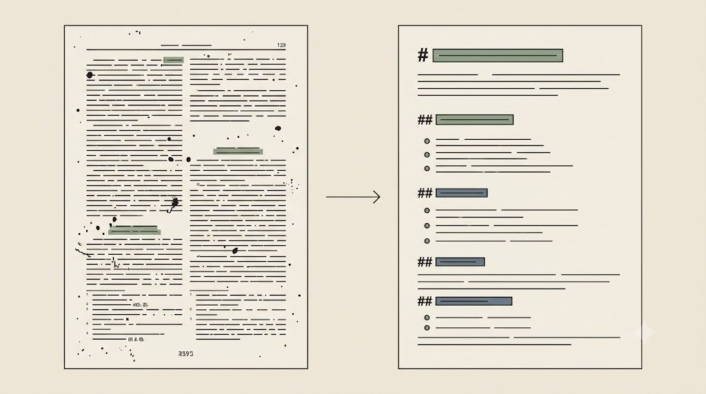

# Inżynieria kontekstu: zakotwiczenie w danych

Większość „słabych odpowiedzi AI" to nie wina modelu, lecz złego doboru kontekstu — za mało, za dużo albo nie tego. Ta część jest o tym, **co** podać modelowi i jak ten materiał przygotować.

## Od inżynierii promptu do inżynierii kontekstu

**Kontekst** to całość tokenów, które model widzi w danym momencie: instrukcja, dane, historia rozmowy i wynik narzędzi. **Inżynieria kontekstu** przesuwa pytanie z „jakich słów użyć" na „jaka *konfiguracja* kontekstu najpewniej da pożądane zachowanie".

Po drodze pojawiają się dwa pojęcia. *Chunking* to dzielenie długiego materiału na mniejsze kawałki. „**Śmietnik kontekstowy**" (ang. *context rot*) to nadmiar nieistotnego tekstu, który obniża jakość — model gubi sygnał w szumie. Wróćmy do metafory biurka: im więcej walających się papierów, tym łatwiej zgubić właściwy.

> **Zasada przewodnia.** Minimalny, ale *wystarczający* kontekst bije „wszystko na raz".

::: {.callout-note title="Higiena długiej sesji"}
Okno kontekstowe zapełnia się z każdą turą rozmowy — historia rośnie, aż jakość spada. Stąd trzy odruchy: po kilkunastu–dwudziestu turach **zacznij sesję od nowa**; **zapisuj ustalenia do pliku** (`PLAN.md`, log) — pliki trwają, kontekst nie; stosuj wzorzec „świeży start": zapisz stan → nowa sesja → „przeczytaj `PLAN.md` i kontynuuj". To ta sama zasada, którą później stosuje agent, odkładając ślad rozumowania na dysk.
:::

::: {.callout-tip title="Ćwiczenie i artefakt"}
Uruchom celowo przeładowany prompt (`kurs-pe/przelaadowany-prompt.md`), w którym instrukcja tonie w czterech stronach tła, i zaobserwuj rozmyty wynik. Odchudź go briefem kontekstowym (`kurs-pe/szablony/brief-kontekstowy-szablon.md`): *cel · odbiorca · co musi być · co pomijam · format*. Test wystarczalności: czy obca osoba wykonałaby zadanie z samego briefu? Policz, ile zdań kontekstu odcięła wersja odchudzona. Artefakt: brief kontekstowy.
:::

::: {.callout-warning title="Druga skrajność: za agresywne przycięcie"}
Ucząc się odchudzać kontekst, łatwo wyciąć informację, której zadanie naprawdę wymaga. Gdy zabraknie potrzebnej danej, model częściej **wypełni lukę zgadywaniem** niż dopyta — to ta sama halucynacja, tylko sprowokowana *brakiem* kontekstu. Klucz to „minimalny, ale **wystarczający**", nie „najmniejszy". Dokładaj kontekst zwrotnie — gdy konkretna porażka modelu pokaże, czego zabrakło — a nie zapobiegawczo.
:::

## Dlaczego Markdown, a nie DOCX/PDF, jest kontekstem dla AI

Model „czytający" surowy PDF dostaje numery stron, stopki i śmieci po OCR — i bierze je za treść. Czyszczenie kontekstu zaczyna się więc *przed* promptem. To zresztą ten sam Markdown, który poznaliśmy jako strukturę promptu — tu używamy go jako *cel konwersji* materiału źródłowego.

- **PDF** to format *układu graficznego*, nie struktury treści: kolumny, nagłówki, stopki, artefakty OCR.
- **DOCX** niesie balast formatowania.
- **Markdown** to czysty tekst ze strukturą (nagłówki, listy): model dostaje treść i hierarchię bez szumu, mniej tokenów idzie na bałagan, a kontekst jest „chudszy" i czytelniejszy.

<!-- ════════ GRAFIKA [G10] ════════
TYP: GENERATOR (parsowanie PDF → Markdown)
PLIK: images/g10-pdf-markdown.png
PROMPT: "Dwa panele obok siebie z poziomą strzałką między nimi. Lewy: zagracona strona PDF — kolumny,
numery stron, stopki, plamki/artefakty po OCR (chaos). Prawy: czysty dokument Markdown — wyraźne nagłówki
i listy (porządek). Minimalistyczna ilustracja edytorska, cienka precyzyjna kreska, płaskie kolory, japandi.
Tło jednolite matowe kremowe #F1ECE3. Akcenty: szałwiowa zieleń #8A9A82, błękit łupkowy #6B7B8C; kreska
atrament #26211C. Bez gradientów, winiet i cieni; tekst jako abstrakcyjne kreski (nieczytelny). 16:9." -->

{fig-align="center" width="100%"}

Konwersja nie wymaga programowania — uruchamiamy gotowy, przetestowany skrypt jedną komendą:

```bash
pip install pymupdf4llm
python konwersja.py artykul.pdf      # → artykul.md  (kurs-pe/konwersja/konwersja.py)
```

Krajobraz narzędzi (stan czerwiec 2026): **pymupdf4llm** jest najlżejsze i świetne do PDF-ów z natywną warstwą tekstu; **Docling** (IBM) lepiej radzi sobie z tabelami i pipeline'ami RAG (potok); **marker** wspiera trudne układy z opcjonalnym wsparciem LLM; **Pandoc** to uniwersalna konwersja między formatami. Uwaga co do klatki prywatności: niektóre parsery (np. Llama Parse) przetwarzają w chmurze — nie do materiałów wrażliwych.

Gdy plików jest więcej — a w prawdziwej kwerendzie są ich dziesiątki — nie uruchamiasz skryptu raz po raz na każdym z osobna. Zaktualizowane **repozytorium materiałów szkoleniowych** (na komputerach laboratoryjnych pod ścieżką `…/00-course-ai-materials/kurs-pe-materialy`, publicznie: [github.com/jaroslawchodak/kurs-pe-materialy](https://github.com/jaroslawchodak/kurs-pe-materialy/)) daje na to gotowy **pipeline zbiorczego (batch) parsowania** wielu PDF-ów naraz. Odpowiada za niego skrypt `konwersja-batch.py`: wskazujesz mu folder z PDF-ami, a on zwraca komplet plików `.md` w katalogu wyjściowym. Instrukcję krok po kroku znajdziesz w pliku `instrukcja-python.md` (**Krok 5**).

```bash
python konwersja-batch.py ./pdfy ./markdown   # cały folder PDF → folder .md
```

Skala nie zwalnia z ostrożności: kontrolę wierności (opisaną niżej) wykonujesz na każdym pliku z osobna, bo batch mnoży nie tylko wygodę, ale i ryzyko cichej utraty treści.

<!-- ════════ Screenshot [s01] ════════ 📸 **MIEJSCE NA ZRZUT EKRANU:** Terminal tuż po uruchomieniu `python konwersja.py artykul.pdf` — widoczne komunikaty „Konwertuję…" i „Gotowe → artykul.md", a obok otwarty plik `artykul.md` w edytorze Markdown z czystą strukturą nagłówków. Ujęcie ma pokazywać efekt „przed / po" (chaos PDF kontra czysty Markdown). Plik docelowy: `images/s01-konwersja-terminal.png`.-->

{fig-align="center" width="100%"}

::: {.callout-tip title="Ćwiczenie i artefakt"}
Skonwertuj własny, zanonimizowany PDF, a potem wyczyść go wg `kurs-pe/konwersja/sciaga-artefakty-ocr.md` — usuń stopki i numery stron, scal złamane akapity. Policz, ile „śmieciowych" linii ubyło. Następnie wykonaj **kontrolę wierności**: porównaj `artykul.md` z oryginałem w 2–3 newralgicznych miejscach (tabela, kluczowa liczba, przypis), bo konwerter potrafi *po cichu* coś zgubić. Dla osób bez Pythona jest wariant awaryjny w edytorze. Artefakt: czysty, zweryfikowany `artykul.md`.
:::

::: {.callout-important title="Cicha utrata treści to główne ryzyko"}
Groźniejsze od widocznych śmieci OCR jest to, że konwerter **bezgłośnie** zgubi tabelę, przypis, wzór albo pojedynczą liczbę — a Ty analizujesz potem uszkodzone „źródło", nie wiedząc o tym. Dopiero plik z potwierdzoną wiernością wolno traktować jako materiał źródłowy do dalszych rozdziałów. Uszkodzona konwersja zatruwa każdy późniejszy cytat-kotwicę.
:::

Mamy czysty materiał. Teraz nadamy mu strukturę danych i zbudujemy z niego matrycę literatury — to następny rozdział.
