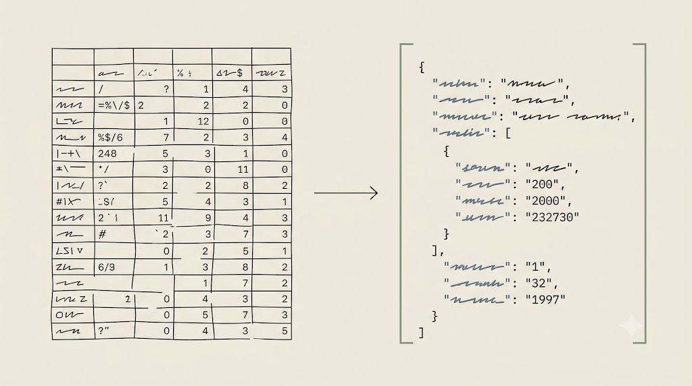
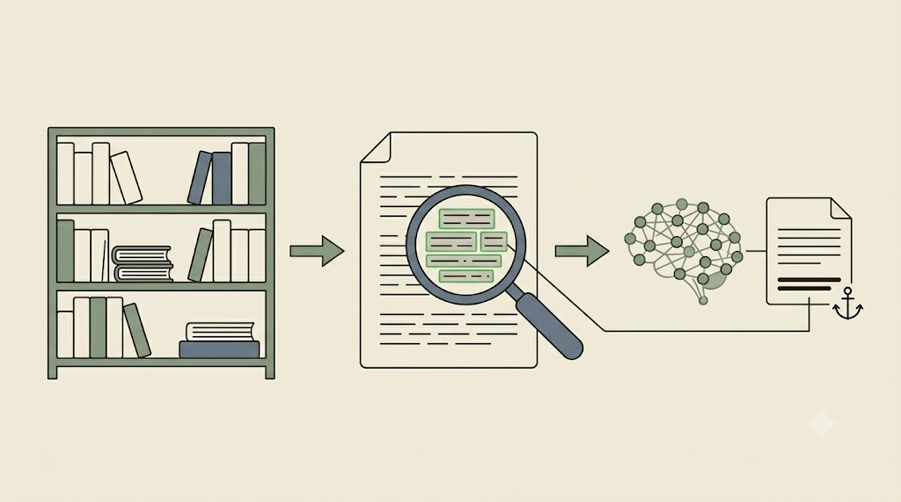

# Dane strukturalne i matryca literatury (RAG)

Czysty Markdown to materiał ciągły. Część informacji badawczych ma jednak **strukturę** — bibliografia, metadane, zakodowane odpowiedzi — i właśnie wtedy sposób ich podania decyduje o wierności wyniku. Ten rozdział łączy dwa kroki na tym samym materiale: zapis danych jako struktura (JSON) oraz zbudowanie z nich „małego RAG" — matrycy literatury.

## Dane strukturalne: JSON zamiast wklejonej tabeli

Wklejona tabela z Excela rozjeżdża się w tekście — model zgaduje, która liczba to rok, a która strona, i myli komórki. Najprościej pomyśleć o tym jak o **fiszce bibliograficznej z etykietami**: zamiast wklejać rozsypany wiersz, zapisujesz każdą informację pod nazwą pola. Dopiero ta fiszka ma techniczną nazwę: **JSON**.

```json
{ "autorzy": ["Kowalski, Jan"], "rok": 2021, "metoda": "analiza jakościowa",
  "glowna_teza": "...", "cytat_kotwica": "...", "strona": 12 }
```

<!-- ════════ GRAFIKA [G11] ════════
TYP: GENERATOR (rozjechana tabela → uporządkowany JSON)
PLIK: images/g11-tabela-json.png
PROMPT: "Dwa panele obok siebie ze strzałką między nimi. Lewy: rozjechana tabela skopiowana z arkusza —
poprzesuwane, pomieszane komórki; niejasne, która liczba to rok, a która strona (chaos). Prawy: uporządkowany
zapis JSON z wyraźnie nazwanymi polami klucz–wartość i schludnymi wcięciami (porządek). Minimalistyczna
ilustracja edytorska, cienka precyzyjna kreska, płaskie kolory, japandi. Tło matowe kremowe #F1ECE3. Akcenty
szałwiowa zieleń #8A9A82 i błękit łupkowy #6B7B8C; kreska atrament #26211C. Bez gradientów, winiet i cieni;
tekst jako abstrakcyjne kreski (nieczytelny). 16:9." -->

{fig-align="center" width="100%"}

JSON ma trzy zalety nad wklejoną tabelą: **nazywa każde pole** (`"rok": 2021` — znika dwuznaczność), jest **stabilny przy zagnieżdżeniu** (np. lista autorów w rekordzie) i — gdy poprosisz o **wynik w JSON** — zwraca dane gotowe do dalszego przetworzenia, choćby wczytania z powrotem do arkusza. Mała, płaska lista do jednorazowego odczytu wystarczy jako CSV; gdy pola są opisowe, zagnieżdżone albo wynik ma trafić do agenta lub API — sięgasz po JSON.

::: {.callout-warning title="Struktura usypia czujność"}
Im czystszy rekord budujesz, tym łatwiej *odruchowo* dołożyć pola identyfikujące (`"nazwisko"`, `"email"`, `"nr_pacjenta"`) — „skoro porządkuję dane, niech będą w komplecie". Tak struktura JSON, która ma pomóc, czyni wyciek najłatwiejszym. Przeciwdziałanie: **klucz zastępczy** (zamiast identyfikatora wstaw `"id": "R-017"`, a mapę trzymaj offline) oraz **minimalizacja pól** — analiza tez nie wymaga nazwisk. Pamiętaj: pseudonimizacja jest odwracalna, więc nie zwalnia z reguł klatki prywatności. Na ćwiczeniach pracujemy wyłącznie na jawnych metadanych bibliograficznych.
:::

::: {.callout-tip title="Ćwiczenie i artefakt"}
Weź 3–5 pozycji z bibliografii (Zotero/Bookends — jawne metadane). Najpierw wklej je jako „brudną" tabelę i poproś o zestawienie; zaobserwuj pomyłki w komórkach. Potem zapisz te same dane w `dane.json` (`kurs-pe/szablony/dane-szablon.json`) jako fiszki z polami *źródło · rok · metoda · teza · luka · cytat-kotwica* i ponów prompt, prosząc o wynik także w JSON. Artefakt: mini-baza literatury w JSON.
:::

## RAG i matryca literatury

„Zapytaj model o literaturę z pamięci" to prosta droga do zmyślonych cytatów. RAG odwraca kolejność.

**RAG po ludzku:** zamiast pytać model z pamięci, **najpierw wyszukujemy właściwe fragmenty z własnych materiałów**, a dopiero potem prosimy o odpowiedź opartą *tylko* na nich. To inżynieria kontekstu w skali biblioteki — albo, jak w metaforze rdzeniowej, egzamin z otwartą książką, ale wyłącznie z *Twoją* książką.

Środowiska, w których to robimy, są lokalne i preferowane: **Obsidian** (notatki i linki), **Zotero** oraz **Bookends** (źródła i cytowania), albo zwykły folder `.md`. DEVONthink pokazuję jako *przykład* zaawansowanego RAG prowadzącego — nie jako wymóg. Notion odpada: serwer w chmurze stawia go poza klatką prywatności.

<!-- ════════ GRAFIKA [G05] ════════
TYP: GENERATOR (diagram RAG)
PLIK: images/g05-rag.png
PROMPT: "Schemat RAG w 3 krokach: (1) biblioteka źródeł → (2) wyszukanie/selekcja trafnych fragmentów
(lupa) → (3) model generuje odpowiedź zakotwiczoną w tych fragmentach. Strzałki, ikony, styl flat,
paleta japandi: matowe kremowe tło #F1ECE3, akcenty szałwiowa zieleń #8A9A82 i błękit łupkowy #6B7B8C, atrament #26211C; bez gradientów i winiet, 16:9, minimum tekstu." -->

{fig-align="center" width="100%"}

W praktyce zaczynamy od **matrycy literatury** — ręcznego, w pełni kontrolowalnego „małego RAG", w którym to badacz decyduje, co wchodzi do kontekstu. Mając choćby kilka wierszy, uruchamiamy prompt zakotwiczony do matrycy:

```text
Na podstawie WYŁĄCZNIE poniższej matrycy:
1) porównaj podejścia metodologiczne; 2) przy każdej tezie wskaż numer wiersza-źródła;
3) nie dodawaj wiedzy spoza tabeli; luki oznacz „brak danych".
```

::: {.callout-important title="Cytaty-kotwice, nie całe PDF-y"}
Do matrycy trafiają **dokładne cytaty z numerem strony**, nie całe dokumenty. Wrzucenie pełnych PDF-ów to klasyczny śmietnik kontekstowy. Groźniejsza jest jednak **konfabulacja komórek**: poproszony, by „pomógł wypełnić" matrycę, model potrafi wygenerować prawdopodobnie brzmiącą tezę, lukę, a nawet *cytat-kotwicę* — z pamięci, nie z Twojego źródła. Jeśli taka komórka wejdzie do matrycy, RAG traci sens. Cytat-kotwica musi być przepisany ze źródła przez badacza; rola modelu to **syntezator, nie autor** ustaleń.
:::

::: {.callout-tip title="Ćwiczenie i artefakt"}
Wypełnij `matryca-literatury.md` (`kurs-pe/szablony/matryca-literatury-szablon.md`) dla 3–5 własnych źródeł: *źródło · rok · metoda · teza · luka · cytat-kotwica (str.)*. Podaj matrycę modelowi i poproś o **przegląd zakotwiczony** z poleceniem „nie wychodź poza tabelę". Następnie przejdź tezę po tezie i sprawdź, czy każda ma numer wiersza-źródła i czy nie pojawiła się wiedza spoza matrycy. Artefakt: matryca + jeden zakotwiczony akapit przeglądowy.
:::

RAG zaczyna się od ludzkiej selekcji — model syntetyzuje to, co *Ty* uznałeś za istotne. To naturalny pomost do następnego rozdziału: NotebookLM, narzędzia, które ten proces częściowo automatyzuje.
