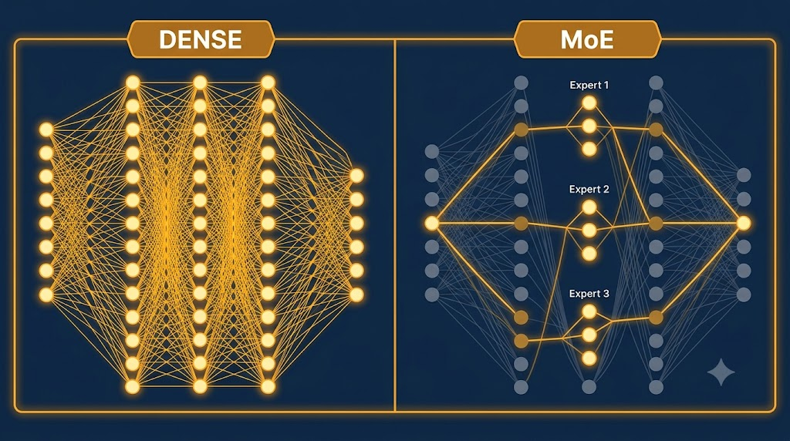

# Lokalne modele LLM

To moment, w którym `privacy cage` przestaje być hasłem, a staje się konfiguracją. Są dane, których po prostu nie wolno wysłać do chmury — i wtedy model lokalny bywa jedyną drogą do użycia AI, za cenę jakości.

## Po co lokalnie — i czego to kosztuje

Sedno jest jedno: **dane nie opuszczają komputera**. To rdzeń klatki prywatności. Cena jest jednak realna i trzeba ją powiedzieć uczciwie:

- modele lokalne są **słabsze od frontier** (więcej błędów, gorsze rozumowanie),
- nie przeglądają internetu — **nie znają „dziś"**, wiedzą tylko to, co zapamiętały do daty treningu,
- ryzyko **halucynacji bywa wyższe** — tym ważniejszy grounding,
- działają **wolniej**; „działa lokalnie" czasem znaczy „czeka się na każde zdanie".

Pod względem sprzętu próg wejścia to około **16 GB RAM**; model rzędu 7–8 mld parametrów w kwantyzacji Q4 działa sensownie przy ~8–12 GB VRAM lub na Apple Silicon z pamięcią zunifikowaną. Uruchamiamy je przez **Ollama** (wiersz poleceń) albo **LM Studio** (interfejs graficzny).

> Pytanie nie brzmi „lokalny czy chmura?", lecz **„dla *których danych* prywatność jest warta utraty jakości?"**

## Uruchamianie modelu lokalnego z agentem

Najważniejsza intuicja: **agent to warstwa nad modelem**. Ten sam OpenCode, Codex czy Claude Code można napędzić modelem w chmurze albo modelem lokalnym. Workflow zostaje ten sam, zmienia się tylko silnik — a dane zostają na dysku.

```bash
# agent „codex" napędzany lokalną Gemmą (MoE, kwantyzacja qat):
ollama launch codex --model gemma4:26b-a4b-it-qat

# agent „claude" napędzany lekkim, lokalnym Granite:
ollama launch claude --model granite4.1:3b
```

Dobór modelu zaczyna się od tego, co udźwignie sprzęt:

| Lżejsze (mniej RAM, słabszy komputer) | Większe (mocniejszy komputer) |
|---|---|
| `gemma4:12b` · `granite4.1:8b` | `gemma4:26b-mlx` · `granite4.1:30b` · `qwen3.6:35b-a3b` |

Sufiksy w nazwach nie są przypadkowe — wyjaśniamy je niżej.

## Dense vs MoE

::: {.columns}
::: {.column width="50%"}
### Dense
Angażuje **wszystkie** parametry przy każdym tokenie.

- większe obciążenie sprzętu,
- przykład: `gemma4:31b`.
:::
::: {.column width="50%"}
### MoE (Mixture of Experts)
Aktywuje **tylko część** parametrów („ekspertów") wybieranych przez router.

- lżejszy dla sprzętu przy podobnej „wiedzy",
- `gemma4:26b-a4b` = 26B łącznie, ~4B aktywnych,
- `qwen3.6:35b-a3b` = 35B łącznie, ~3B aktywnych.
:::
:::

<!-- ════════ GRAFIKA [G06] ════════
TYP: GENERATOR (diagram porównawczy)
PLIK: images/g06-dense-moe.png
PROMPT: "Porównanie Dense vs MoE. Po lewej sieć, w której świecą WSZYSTKIE węzły (Dense). Po prawej
sieć, w której świeci tylko kilku wybranych ekspertów, reszta wyszarzona (MoE). Podpisy 'Dense' i
'MoE'. Styl flat, paleta japandi: matowe kremowe tło #F1ECE3, akcenty szałwiowa zieleń #8A9A82 i błękit łupkowy #6B7B8C, atrament #26211C; bez gradientów i winiet, 16:9." -->

{fig-align="center" width="78%"}

Praktyczny wniosek dla badacza: na laptopie model MoE często daje lepszy stosunek jakości do zużycia pamięci niż model gęsty o tej samej liczbie parametrów. Stąd na słabszym sprzęcie sięgamy po `26b-a4b`, a nie po pełną „trzydziestkę jednkę" gęstą.

## Agentic vs chatbot — najważniejsze rozróżnienie

To jedno z najczęstszych źródeł rozczarowań. Ludzie biorą model, który pięknie odpowiada w czacie, wsadzają go do agenta i dziwią się, że nie wywołuje narzędzi i gubi format.

- **Model agentyczny** potrafi wywoływać narzędzia (*tool calling*), trzymać format i działać w pętli — czytać pliki, wyszukiwać, zapisywać wyniki. Nadaje się do RAG i do pipeline'ów.
- **Chatbot** świetnie rozmawia, ale w roli agenta zawodzi.

::: {.callout-warning title="Bielik: świetny chatbot, nie agent"}
Polski **Bielik** (oraz **Bielik-Minitron**) ma doskonałe rozumienie polszczyzny i jest znakomity do rozmowy, redakcji czy streszczeń po polsku — ale **nie jest modelem agentycznym** z niezawodnym tool callingiem. Do klastrowania, RAG czy uruchamiania narzędzi dobieramy model agentyczny, a nie najlepszego rozmówcę.
:::

## Kwantyzacja — jak wybrać wariant

**Kwantyzacja** to kompresja wag modelu: mniej bitów na wagę oznacza mniej zużytej pamięci kosztem niewielkiego spadku jakości. Dlatego ten sam model występuje w kilku „rozmiarach na dysku".

- `q4` (np. `Q4_K_M`) — typowy **sweet spot** jakość/pamięć,
- `q3`, `q2` — gdy brakuje RAM, kosztem jakości,
- **`qat`** (*quantization-aware training*, np. nowa **Gemma** `…-it-qat`) — model **uczony pod kwantyzację**, więc po skompresowaniu trzyma wyższą jakość przy małym rozmiarze.

> **Reguła kciuka.** Zacznij od **Q4 lub qat**; schodź niżej tylko, gdy model nie mieści się w pamięci. Nie ścigaj się o najniższy bit.

::: {.callout-tip title="Ćwiczenie i artefakt"}
Niezależnie od sprzętu wypełnij kartę `privacy-cage.md` (`kurs-pe/szablony/privacy-cage-szablon.md`): typ zadania/danych → środowisko (frontier w chmurze / lokalny LLM / bez AI). Kto ma sprzęt — uruchamia mały model w Ollama/LM Studio i przepuszcza przez niego wrażliwszy, ale zanonimizowany fragment. Artefakt: karta decyzyjna `privacy cage`.
:::

Skoro umiemy już podpiąć model — chmurowy lub lokalny — pod agenta, pora przyjrzeć się samym agentom: którym poświęcić uwagę i gdzie one „mieszkają".
