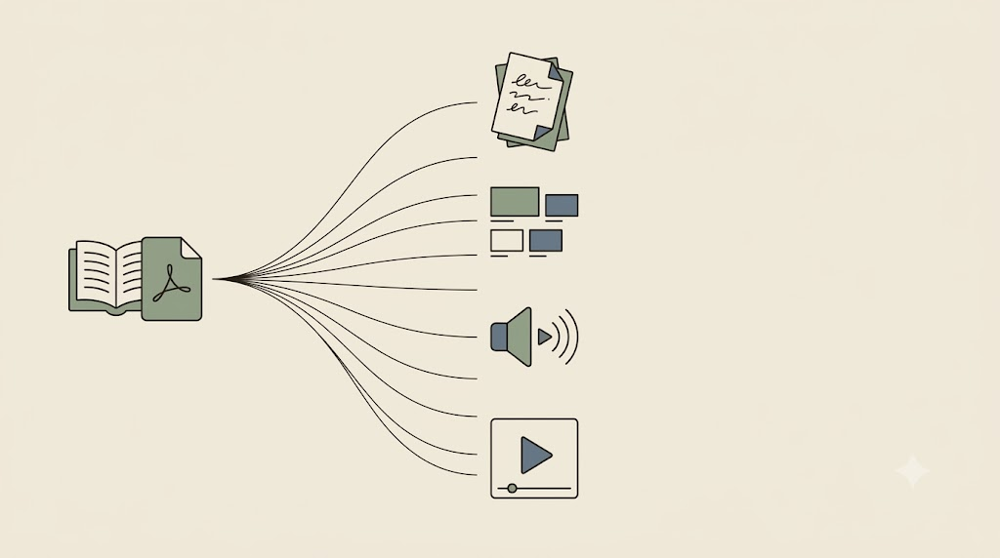
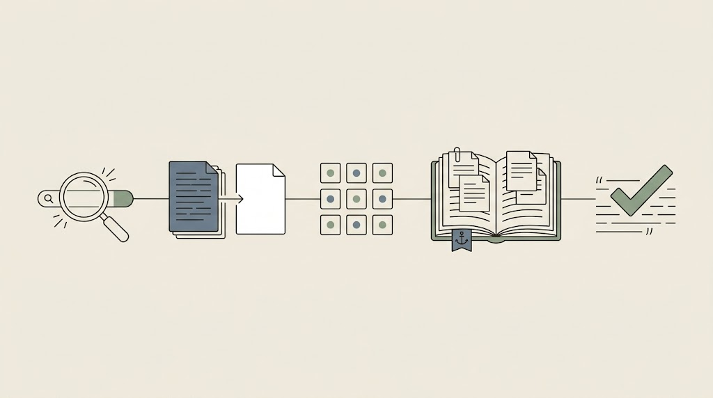

# NotebookLM — parser i generator notatek

NotebookLM jest wygodnym mostem między rozdziałem o RAG a codzienną praktyką badacza. Wczytuje wiele źródeł i pozwala je odpytywać z zakotwiczeniem (*groundingiem*) w tych źródłach — a przy tym wyprowadza wynik w zaskakująco wielu formatach.

## Czym jest i co potrafi

NotebookLM **wczytuje wiele źródeł** naraz (PDF-y, strony, wideo, własne notatki) i odpowiada na pytania, opierając się na tych źródłach i opatrując odpowiedzi odnośnikami. To zakotwiczenie w gotowym narzędziu.

Jego druga siła to **rozległy output**. Z tego samego materiału można wygenerować:

- streszczenia i przeglądy z cytowaniami do źródeł,
- **prezentacje, PDF, PPTX**,
- **wideo** (omówienia) oraz **podcasty audio** — rozmowę dwóch syntetycznych głosów.

<!-- ════════ GRAFIKA [G12] ════════
TYP: GENERATOR (jedno źródło → wiele wyjść)
PLIK: images/g12-notebooklm-outputy.png
PROMPT: "Jedno źródło po lewej (książka/PDF) rozchodzi się wachlarzem cienkich linii do wielu wyjść po
prawej: notatki, slajdy, ikona audio (podcast), ikona wideo. Minimalistyczna ilustracja edytorska, cienka
precyzyjna kreska, płaskie kolory, japandi. Tło jednolite matowe kremowe #F1ECE3, dużo pustej przestrzeni.
Akcenty: szałwiowa zieleń #8A9A82 i błękit łupkowy #6B7B8C; kreska atrament #26211C. Bez gradientów, winiet
i cieni, bez czytelnego tekstu. 16:9." -->

{fig-align="center" width="100%"}


<!-- ════════ Screenshot [s02] ════════
> 📸 **MIEJSCE NA ZRZUT EKRANU:** Interfejs NotebookLM — po lewej panel źródeł (kilka wgranych PDF-ów / książka), w środku odpowiedź z cytowaniami `[1][2]`, po prawej panel generowania (Audio Overview / wideo / notatki). Ujęcie ma uwidocznić, że output jest wielokanałowy. Plik docelowy: `images/s02-notebooklm.png`. -->

{fig-align="center" width="100%"}

## Case study: czytanie książki naukowej

Najlepiej pokazać NotebookLM na konkretnym, sprawdzonym schemacie czytania książki. Zaczynamy od **preambuły sesji**, którą wklejamy raz — to zakotwiczenie w czystej postaci, te same zasady, które poznaliśmy wcześniej, tylko zaaplikowane do całej książki:

```markdown
Zasady na całą rozmowę:
- Odpowiadaj wyłącznie na podstawie wgranych źródeł.
- Wskazuj rozdział/sekcję lub przypisy. Nie zmyślaj numerów stron.
- Zachowuj dokładne terminy autora; cytuj krótką frazę, gdy liczy się brzmienie.
- Oddzielaj twierdzenia autora od własnych wniosków; wnioski oznaczaj „(wniosek)".
- Brak podstaw w źródłach → powiedz to wprost, nie zgaduj.
```

Dalej idzie sekwencja siedmiu kroków; tu trzy reprezentatywne (pełny schemat w pliku `NotebookLM-book-reading-PL.md`):

```markdown
1 · Orientacja: główny problem, teza autora (2–3 zd.), pole/debata, typ książki.
4 · Aparat pojęciowy: tabela 5–12 pojęć | definicja autora | rola | pojęcie powiązane.
7 · Synteza + 8 notatek trwałych (jednozdaniowych, z lokalizacją w źródle).
```

::: {.callout-note title="Ugruntowana krytyka wymaga dodatkowych źródeł"}
Krok krytyczny — ocena książki — jest naprawdę mocny dopiero, gdy do notatnika dorzucisz **recenzje albo prace konkurencyjne** jako dodatkowe źródła. Inaczej krytyka wisi w powietrzu. To ta sama zasada, co przy matrycy literatury: jakość wyniku zaczyna się od doboru wejścia.
:::

## Ta sama książka, trzy pytania dyscyplinarne

Zakotwiczenie działa **niezależnie od dyscypliny**. Na *tych samych* wgranych źródłach zmienia się nie narzędzie, lecz *pytanie badacza* — a reguła „odpowiadaj wyłącznie z materiału" pozostaje ta sama:

- 🔬 **Chemik / przyrodnik:** „Jakie **metody i procedury** opisuje tekst? Zestaw je w tabeli: metoda | warunek | ograniczenie | lokalizacja w źródle."
- 🧠 **Psycholog / badacz społeczny:** „Jakie **konstrukty i zmienne** wprowadza autor? Jak je definiuje i operacjonalizuje?"
- 📜 **Historyk / humanista:** „W jakim **kontekście** powstała praca i z jaką debatą polemizuje? Zacytuj fragmenty świadczące o pozycji autora."

Jedno narzędzie i jedna reguła zakotwiczenia obsługują chemika, psychologa i historyka jednakowo. To praktyczny dowód, że dobór *pytania* leży po stronie badacza, a zakotwiczenie po stronie metody — nie dyscypliny.

## Gdzie NotebookLM leży w ścieżce pracy z literaturą

NotebookLM nie zastępuje wcześniejszych kroków — wpina się między nie. Cała ścieżka pracy z literaturą, którą składamy przez kurs, tworzy powtarzalny ciąg:

**kwerenda** (deep research) → **czyszczenie i streszczenie** (PDF → Markdown) → **matryca / „mały RAG"** → **zakotwiczona lektura wielu źródeł** (NotebookLM) → **weryfikacja cytowań** (u źródła).

<!-- ════════ GRAFIKA [G30] ════════
TYP: GENERATOR (ścieżka pracy z literaturą)
PLIK: images/g30-sciezka-literatury.png
PROMPT: "Pięć ogniw połączonych jedną ciągłą poziomą linią w łańcuch, każde jako drobny piktogram: lupa nad polem
(kwerenda); dokument zmieniający się w czysty arkusz (czyszczenie i streszczenie); siatka kart (matryca / mały RAG);
otwarta książka z kilkoma wpiętymi źródłami i małą kotwicą (zakotwiczona lektura wielu źródeł); ptaszek weryfikacji
nad cytatem (weryfikacja cytowań). Sens: jeden powtarzalny ciąg pracy z literaturą. Styl flat, cienka precyzyjna
kreska, paleta japandi: matowe kremowe tło #F1ECE3, akcenty szałwiowa zieleń #8A9A82 i błękit łupkowy #6B7B8C,
atrament #26211C; bez gradientów i winiet, 16:9, bez tekstu." -->

{fig-align="center" width="100%"}

## Możliwości a ograniczenia

Symetria z resztą kursu jest prosta: każde mocne narzędzie ma cenę.

::: {.columns}
::: {.column width="50%"}
**Mocne strony**

- zakotwiczenie z cytowaniami do źródeł,
- szybkie ogarnięcie wielu materiałów,
- wieloformatowy output (audio, wideo, slajdy),
- świetne do dydaktyki i powtórki.
:::
::: {.column width="50%"}
**Ograniczenia / ryzyka**

- chmura Google → uwaga, klatka prywatności,
- potrafi zmyślać numery stron,
- audio/wideo bywa efektowne, ale spłyca,
- to wciąż asystent — weryfikacja po stronie badacza.
:::
:::

::: {.callout-important title="Tylko źródła jawne"}
Ceną wygody jest chmura: materiały trafiają na serwery Google. Niezanonimizowanych transkrypcji, recenzji pod NDA czy danych pacjentów tam **nie wgrywamy**. To naturalne wejście w część o agentach, gdzie pokazujemy, jak te same zadania zrobić lokalnie, gdy dane są wrażliwe.
:::

NotebookLM domyka temat kontekstu od strony narzędzia gotowego. Teraz przechodzimy do agentów — najpierw do trybów *deep research*, a potem do tego, co zrobić, gdy dane nie mogą opuścić komputera.
