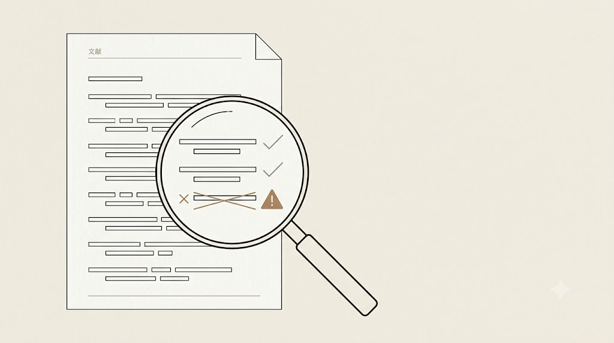
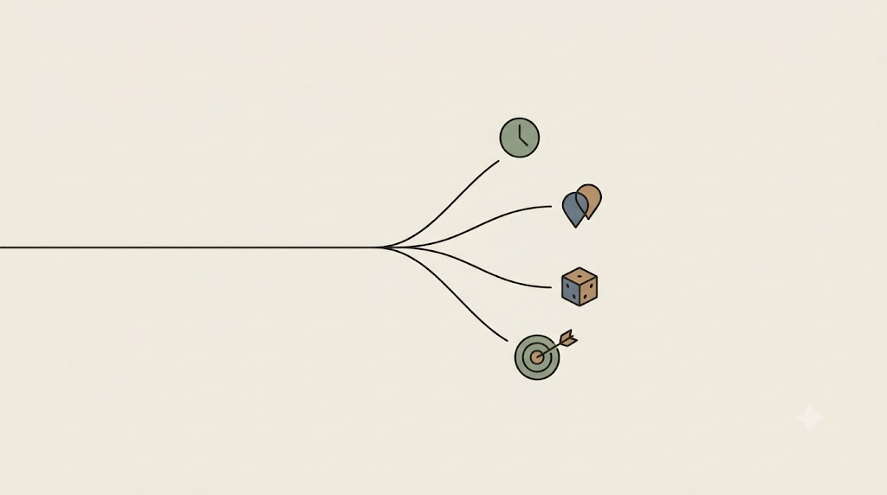
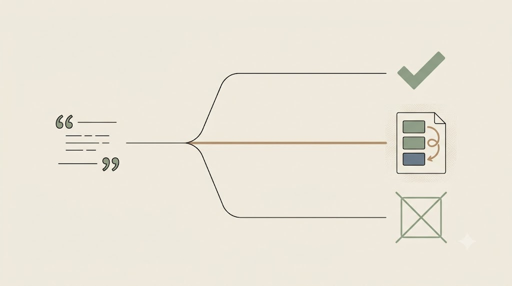

# Deep research i jego granice

Tę część zaczynamy od narzędzi, które robią najwięcej za nas — i właśnie dlatego wymagają najwięcej czujności.

## Spektrum: od czatu do agentowego raportu

Między prostym czatem a pełnym agentem jest całe spektrum:

- **czat** odpowiada z pamięci,
- **tryb research** dokłada przeszukiwanie sieci i cytaty,
- **agentowy deep research** planuje, wyszukuje wielokrotnie i składa wielostronicowy raport.

W praktyce badacza krążą tu konkretne narzędzia: **ChatGPT i Gemini Deep Research** oraz **Perplexity** po stronie ogólnej; **Elicit** (ekstrakcja danych z wielu prac), **Consensus** (synteza „co mówi nauka"), **Scite** (kontekst cytowań: czy praca wspiera, czy podważa) po stronie literaturowej; oraz grafy powiązań — **Connected Papers, Litmaps, Research Rabbit**. Pod spodem leżą otwarte źródła: **OpenAlex, Semantic Scholar, arXiv, PubMed**.

## „Deep research, płytka sprawczość"

Deep research generuje *ładny raport* — ale ładny raport z trzema zmyślonymi cytatami jest gorszy niż brak raportu, bo usypia czujność. Narzędzia te świetnie **zbierają**, lecz **nie zastępują oceny badacza**: zdarzają im się źródła nieistniejące lub błędnie sparafrazowane oraz tendencyjny dobór.

<!-- ════════ GRAFIKA [G14] ════════
TYP: GENERATOR (weryfikacja cytowań)
PLIK: images/g14-deep-research-weryfikacja.png
PROMPT: "Kartka raportu z listą cytowań (jako abstrakcyjne kreski) i lupa najechana na trzy z nich: dwa
oznaczone delikatnym ptaszkiem (zweryfikowane), jeden przekreślony / ze znakiem ostrzeżenia (zmyślony).
Minimalistyczna ilustracja edytorska, cienka precyzyjna kreska, płaskie kolory, japandi. Tło matowe kremowe
#F1ECE3, dużo pustej przestrzeni. Akcenty: szałwiowa zieleń #8A9A82 (ok) oraz ciepły akcent #B08A6A
(ostrzeżenie); kreska atrament #26211C. Bez gradientów, winiet i cieni, bez czytelnego tekstu. 16:9." -->

{fig-align="center" width="100%"}

::: {.callout-important title="Obowiązkowa weryfikacja próbki"}
Z każdego raportu wylosuj **trzy cytowania** i sprawdź je u źródła (DOI, PubMed, OpenAlex). Zapisz, ile przeszło weryfikację. To nie biurokracja — to jedyna rzecz, która odróżnia przegląd od ładnie sformatowanego zgadywania. Przy materiale idącym do publikacji sprawdzasz **każde** cytowanie, nie tylko próbkę.
:::

## Test luki cytowań: który „agent" naprawdę rozumuje

Większość narzędzi deep research reklamuje się jako *agenci* albo *asystenci badawczy* — co sugeruje, że ułożą plan do dowolnego zadania. W praktyce wiele z nich to przepływy **zaszyte na sztywno**: model podejmuje decyzje w kilku punktach z góry zaprojektowanej procedury, ale nie potrafi *zaprojektować nowej procedury* dla zadania spoza schematu. Prosty test diagnostyczny (za: Aaron Tay, *Deep Research, Shallow Agency*, 2025) tę różnicę odsłania:

```text
Znajdź artykuł „<tytuł znanego, otwartego artykułu>".
Następnie wskaż prace powiązane tematycznie, które MOGŁY zostać
w nim zacytowane, ale NIE są cytowane.
```

Zadanie wymaga rozłożenia na kroki: znajdź artykuł → wyciągnij jego bibliografię → znajdź prace pokrewne → odejmij to, co już zacytowane. Narzędzia o sztywnym przepływie zatrzymują się na samym odnalezieniu artykułu albo zwracają prace **już cytowane** — bo w ich procedurze brak kroku „sprawdź, czego artykuł NIE cytuje".

Wynik dowolnego raportu można ocenić przez **cztery typowe tryby porażki** — to gotowa soczewka, nie materiał do zapamiętania:

| Tryb porażki | Jak wygląda w wyniku |
|---|---|
| **Błąd chronologiczny** | sugeruje prace **nowsze** niż artykuł kotwiczny (zignorował ramę czasową) |
| **Nadmiarowość** | podaje prace **już cytowane** (nie odjął bibliografii źródła) |
| **„Przypadkowy sukces"** | trafia w niecytowane prace, choć **w ogóle nie sprawdził** bibliografii |
| **Wynik nietrafny** | zwraca prace **spoza tematu**, byle spełnić warunek „niecytowane" |

<!-- ════════ GRAFIKA [G23] ════════
TYP: GENERATOR (cztery tryby porażki deep research)
PLIK: images/g23-tryby-porazki.png
PROMPT: "Pojedyncze zadanie badawcze wchodzi z lewej jako jedna cienka linia, po czym rozwidla się na cztery
krótkie rozbieżne ścieżki, każda zakończona małym, odrębnym znakiem porażki: zegar (błąd chronologiczny), znak
nakładania/duplikatu (nadmiarowość), kostka/przypadek (przypadkowy sukces), strzała mijająca okrąg (wynik
nietrafny). Styl flat, cienka precyzyjna kreska, paleta japandi: matowe kremowe tło #F1ECE3, akcenty szałwiowa
zieleń #8A9A82 i błękit łupkowy #6B7B8C, ciepły akcent ostrzegawczy #B08A6A, atrament #26211C; bez gradientów
i winiet, 16:9, bez tekstu." -->

{fig-align="center" width="100%"}

> Etykieta „agent" nie gwarantuje sprawczości — *przetestuj* granice narzędzia zadaniem spoza jego schematu, zanim mu zaufasz.

## Warsztat weryfikacji źródeł: trzystopniowy werdykt

„Sprawdź, czy DOI działa" to za mało. Najgroźniejsza halucynacja bibliograficzna to nie zmyślony identyfikator — ten wychwyci każde kliknięcie — lecz **źródło prawdziwe z fałszywą tezą**: praca istnieje, DOI prowadzi we właściwe miejsce, ale model przypisał jej twierdzenie, którego autorzy nigdy nie postawili. Taki cytat przechodzi przez pobieżną kontrolę i osadza się w przeglądzie jako „zweryfikowany".

Dlatego weryfikację *jednego* cytowania rozkładamy na pięć kroków:

1. **DOI → [doi.org](https://doi.org).** Czy identyfikator istnieje i prowadzi do *tego* tytułu?
2. **Tytuł → Google Scholar / OpenAlex / PubMed.** Czy autorzy i rok się zgadzają?
3. **Teza → źródło (krok krytyczny).** Czy praca *rzeczywiście twierdzi* to, co przypisał jej model? Tu odsiewa się prawdziwe źródło z przekręconą tezą.
4. **[Scite](https://scite.ai) — druga opinia.** Smart Citations pokazują, czy inne prace tę tezę wspierają, podważają, czy jedynie wzmiankują.
5. **Werdykt — trzystopniowy, nie binarny.**

Sednem jest właśnie trzystopniowość: ocena „prawda / fałsz" gubi najczęstszy przypadek — ten ze środka tabeli.

| Werdykt | Co znaczy | Co robisz |
|---|---|---|
| **istnieje + trafne** | praca jest i mówi to, co przypisał jej model | wolno użyć — z własnym cytatem-kotwicą |
| **istnieje + przekręcone** | praca jest, ale teza zniekształcona | **nie używaj cytatu modelu** — wróć do źródła i sformułuj tezę sam |
| **nie istnieje** | brak pracy albo zmyślony DOI | skreśl; poszukaj realnego źródła |

<!-- ════════ GRAFIKA [G28] ════════
TYP: GENERATOR (trzystopniowy werdykt weryfikacji)
PLIK: images/g28-trzystopniowy-werdykt.png
PROMPT: "Pojedynczy cytat wchodzi z lewej cienką linią i rozdziela się na trzy poziome tory prowadzące do trzech
odrębnych znaków: zielony ptaszek (istnieje + trafne); zgięta/skrzywiona strzałka wewnątrz obecnego dokumentu
(istnieje + przekręcone — praca jest, ale teza wygięta); przekreślony pusty prostokąt (nie istnieje). Środkowy tor
subtelnie wyróżniony jako najważniejszy i najczęstszy. Styl flat, cienka precyzyjna kreska, paleta japandi: matowe
kremowe tło #F1ECE3, akcenty szałwiowa zieleń #8A9A82 i błękit łupkowy #6B7B8C, ciepły akcent ostrzegawczy #B08A6A,
atrament #26211C; bez gradientów i winiet, 16:9, bez tekstu." -->

{fig-align="center" width="100%"}

Ściąga z całą procedurą: `kurs-pe/szablony/protokol-weryfikacji-zrodel.md`.

::: {.callout-tip title="Ćwiczenie i artefakt"}
Napisz `protokol-deep-research.md` (`kurs-pe/szablony/protokol-deep-research-szablon.md`): pytanie, kryteria włączenia i wyłączenia, oczekiwane typy źródeł. Uruchom jedno narzędzie deep research i jedno literaturowe na tym samym pytaniu, po czym zweryfikuj trzy cytowania. Dla każdego narzędzia zaznacz, który z **czterech trybów porażki** się ujawnił, a każdemu z trzech sprawdzonych cytowań przypisz **trzystopniowy werdykt** (istnieje + trafne / istnieje + przekręcone / nie istnieje). Artefakt: protokół + karta krytycznej oceny z odsetkiem zweryfikowanych źródeł.
:::

::: {.callout-warning title="Outsourcing osądu to outsourcing odpowiedzialności"}
Gdy raport deep research trafia — choćby fragmentami — do Twojego przeglądu, to **Ty** firmujesz każdy cytat własnym nazwiskiem. Zmyślone źródło w recenzji czy publikacji jest *naruszeniem rzetelności naukowej*, nie „błędem narzędzia", a „tak podała AI" nie chroni autora ani współautorów. Raport to **lista tropów do sprawdzenia**, nie gotowy przegląd.
:::

> **Pytanie, które zostaje z Tobą.** Gdzie kończy się praca, którą mogę powierzyć narzędziu, a zaczyna ta, za którą jako autor odpowiadam osobiście?

Deep research działa w chmurze i na danych jawnych. Co jednak, gdy materiał jest wrażliwy i nie może opuścić komputera? Wtedy schodzimy na poziom modeli lokalnych — i to jest temat następnego rozdziału.
