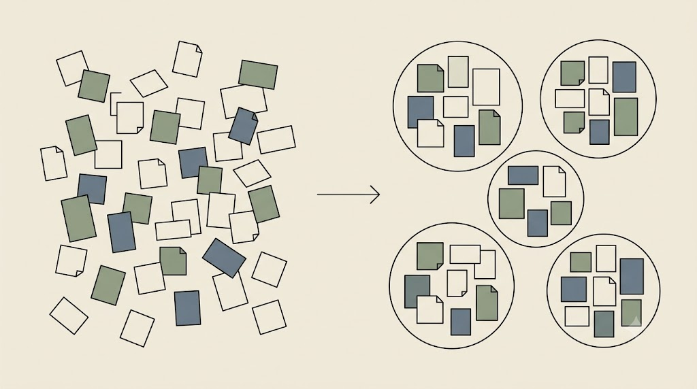

# Clustering Demo — agent w działaniu

To zwieńczenie całego kursu i dowód, że agent nie jest magią, lecz złożeniem wszystkiego, co budowaliśmy przez trzy dni: promptu, kontekstu, pliku instrukcji i nadzoru człowieka. Pokaz prowadzę na żywo; tutaj zostają ramy i odsyłacze.

## Scenariusz

Agent dostaje folder ze streszczeniami literatury, **czyta wszystko**, **grupuje teksty tematycznie**, wykrywa **napięcia i luki**, a na końcu zapisuje dwa artefakty: raport analityczny i strukturę przyszłego przeglądu w formacie OPML.

Wyobraź sobie folder z setką streszczeń. Mówisz: „przeczytaj wszystko, pogrupuj tematycznie, wskaż luki, zapisz raport i plan przeglądu". Wracasz po kawę — raport czeka, z listą plików, których agent użył, i z miejscami, gdzie sam się waha.

<!-- ════════ GRAFIKA [G13] ════════
TYP: GENERATOR (rozsypane notatki → klastry)
PLIK: images/g13-klastrowanie.png
PROMPT: "Po lewej luźno rozrzucone karteczki/notatki (chaos). Po prawej te same karteczki zebrane w kilka
wyraźnych, otoczonych cienką linią grup-klastrów (porządek); pozioma strzałka między panelami.
Minimalistyczna ilustracja edytorska, cienka precyzyjna kreska, płaskie kolory, japandi. Tło jednolite
matowe kremowe #F1ECE3, dużo pustej przestrzeni. Akcenty: szałwiowa zieleń #8A9A82 i błękit łupkowy #6B7B8C;
kreska atrament #26211C. Bez gradientów, winiet i cieni, bez czytelnego tekstu. 16:9." -->

{fig-align="center" width="80%"}

## Struktura pipeline'u

Pełny, sprawdzony pipeline leży w katalogu `clustering-demo`; jego opis i powiązania z kursem są w `kurs-pe/modul-clustering-demo.md`.

| Element | Rola |
|---|---|
| `AGENTS.md` | Profil agenta: rola „Principal Research Synthesizer", kompetencje, ton, reguły. |
| `CONTEXT.md` | Wiedza dziedzinowa: pogranicze AI i nauk społecznych, oczekiwane osie tematyczne. |
| `WORKFLOW.md` | Procedura krok po kroku + dokładna struktura outputu każdego klastra. |
| `EXECUTION-PROMPT.md` | Prompt wykonawczy uruchamiający proces. |
| `./summaries/` | **Wejście** — streszczenia `*.md` do sklastrowania. |
| `./outputs/` | **Wyjście** — `report.md` i `outline.opml`. |
| `./agent_logs/` | Ślad rozumowania agenta (przejrzystość). |

Każdy klaster opisywany jest wedle stałego schematu z `WORKFLOW.md`: *proponowana kolejność, nazwa klastra, krótka definicja, lista tekstów, wspólne pojęcia, napięcia w grupie, luki w materiale*. Na tej podstawie agent wskazuje **niedostatecznie zbadane problemy badawcze** w całej domenie.

<!-- ════════ GRAFIKA [S03] ════════
TYP: SCREENSHOT
PLIK: images/s03-clustering-demo.png
DO UCHWYCENIA: "Agent (Claude Code lub OpenCode) wykonujący clustering-demo: drzewo katalogu po lewej
(summaries/ z wieloma plikami, outputs/, agent_logs/), log rozumowania w środku, wygenerowany
outline.opml lub report.md po prawej." -->

{fig-align="center" width="82%"}

## Kto może to uruchomić

Pipeline jest **agnostyczny względem narzędzia** — odpalisz go dowolnym agentem nad plikami:

- **Claude Code / Claude Cowork** — rekomendowany,
- **Codex**,
- **Antigravity** (nowe Gemini lub cenione starsze: Opus 4.6, Sonnet),
- **OpenCode + model lokalny** (Ollama) albo darmowe modele dostępne w OpenCode (m.in. od Nvidii).

::: {.callout-important title="Privacy cage w praktyce"}
Uruchomienie przez OpenCode z **modelem lokalnym** oznacza, że streszczenia **nie opuszczają komputera**. To ten sam workflow, ale w pełnej klatce prywatności — idealny dla materiałów wrażliwych.
:::

::: {.callout-note title="Dwa wnioski z demonstracji"}
Po pierwsze, na pokazie do folderu `summaries/` trafia znacznie więcej plików — kilkadziesiąt do stu — żeby było widać prawdziwą skalę możliwości modeli agentycznych. Po drugie, outputem jest nie tylko raport, ale i **OPML** — czyli struktura, którą już znamy, gotowa do napisania własnego przeglądu literatury.
:::

Agent zadziałał. Zostaje złożyć wszystkie nawyki z trzech dni w jeden, powtarzalny i bezpieczny protokół — i to jest temat ostatniego rozdziału.
