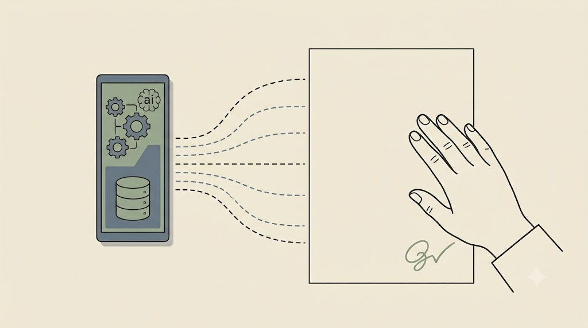
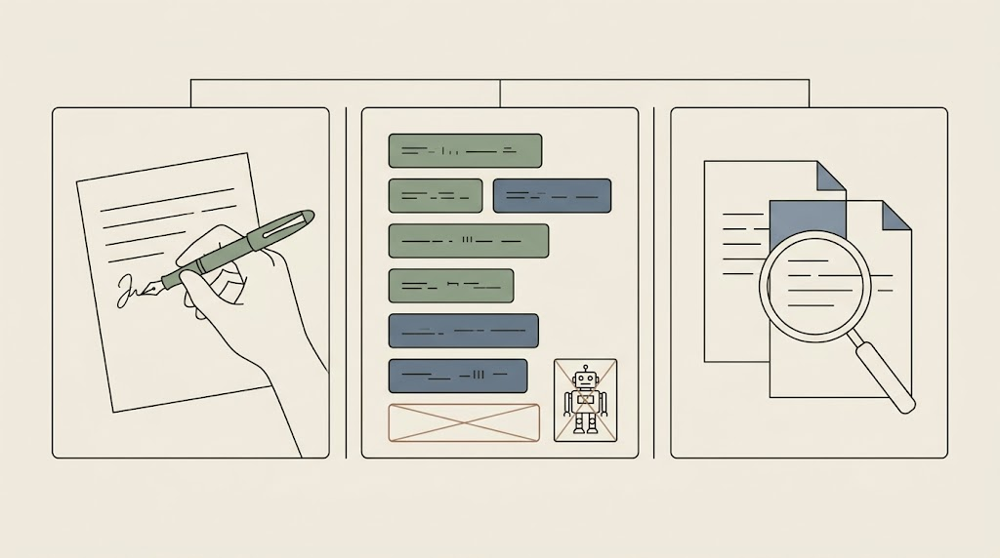

# Etyka i granice AI

Ten rozdział jest krótki, ale bez niego cały warsztat byłby naiwny. Zbiera wątki etyczne rozsiane po wszystkich poprzednich rozdziałach — od ograniczonego zaufania, przez zakotwiczenie i klatkę prywatności, po nadzór nad agentem — i domyka je jedną tezą.

> **Refleksyjność badacza zostaje po stronie człowieka.**

## Co zostaje przy badaczu — nawet z agentem

AI nie ma biografii ani stawki w temacie. Dlatego trzy rzeczy są **nieprzekazywalne**, niezależnie od tego, jak sprawny jest agent:

- **Pozycja badacza.** Kto pyta, z jakiej pozycji, z jakimi założeniami. Agent nie umiejscowi kategorii względem własnych uprzedzeń, bo ich nie ma.
- **Odpowiedzialność za interpretację.** Model może *zaproponować* kategorie czy wzorce; ich osadzenie w teorii i kontekście to praca badacza.
- **Autorstwo wyniku.** Refleksyjność nie znika z pojawieniem się agenta — wymaga jawnego opisu: co zrobił człowiek, a co narzędzie.

<!-- ════════ GRAFIKA [G26] ════════
TYP: GENERATOR (odpowiedzialność zostaje przy badaczu)
PLIK: images/g26-odpowiedzialnosc.png
PROMPT: "Dłoń badacza spoczywa spokojnie na pojedynczej kartce z małym znakiem podpisu, podczas gdy obok unosi
się smukły panel AI, podsuwając propozycje jako cienkie przerywane linie — ale przerywane linie zatrzymują się
na krawędzi kartki, nie wkraczając na podpisany arkusz. Sens: narzędzie pomaga do pewnej granicy; autorstwo i
odpowiedzialność zostają przy człowieku. Styl flat, cienka precyzyjna kreska, paleta japandi: matowe kremowe
tło #F1ECE3, akcenty szałwiowa zieleń #8A9A82 i błękit łupkowy #6B7B8C, atrament #26211C; bez gradientów i
winiet, 16:9, bez tekstu." -->

{fig-align="center" width="100%"}

> **Narzędzie można delegować; odpowiedzialności — nie.**

## Bezpieczna praca to zwykła, rygorystyczna higiena

Pięć reguł, które przewijały się przez całe szkolenie jako konkretne nawyki — tu zebrane razem:

- **Źródło dla każdego twierdzenia** — twierdzenie bez źródła to nie ustalenie, lecz halucynacja.
- **Oddzielaj cytat, parafrazę i interpretację** — cytat zlepiony z parafrazą to plagiat w cudzysłowie.
- **Anonimizuj przed chmurą** — dane wrażliwe bez anonimizacji to naruszenie zaufania, a przy danych osobowych — naruszenie RODO (wklejenie = przetwarzanie; minimalizacja, podstawa prawna, konsultacja z IOD/DPO). Pamiętaj: pseudonimizacja jest *odwracalna*, więc nie czyni danych anonimowymi.
- **Pracuj na kopiach** — źródła nigdy nie są edytowane przez agenta.
- **Zapisuj ślad pracy** — log (`agent_logs/`) to nie luksus, to warunek brzegowy odtwarzalności.

## Ujawnianie użycia AI — część rzetelności

Deklaracja użycia AI to dziś element uczciwości naukowej, nie formalność: **Nature, czasopisma APA i SAGE** już jej **wymagają**, a tam, gdzie nie wymagają, jej brak bywa odczytany jako naukowa nieuczciwość. Zasada jest prosta: opisz jawnie, *co zrobił człowiek, a co narzędzie* — wkład koncepcyjny, argumenty i sądy analityczne pozostają wkładem autora.

```text
## AI Disclosure Statement
This manuscript was developed through a human–AI collaborative writing process.
The conceptual framework, core arguments, theoretical choices, and analytical
judgments are the sole intellectual contribution of the author. AI tools were
used to assist with drafting, organization, and citation management.
```

::: {.callout-note title="Szablon i wytyczne czasopisma"}
Gotowy szablon (EN + PL, z listą zastosowań do zaznaczenia) jest w `kurs-pe/szablony/ai-disclosure-szablon.md`. Zawsze sprawdź konkretne wytyczne docelowego czasopisma — bywają bardziej szczegółowe niż ogólna zasada.
:::

## Prawo autorskie i autorstwo dzieła współtworzonego z AI

Powracające pytanie badaczy brzmi wprost: *czy mogę być uznany za twórcę tekstu powstałego z udziałem AI — i czy nie naruszę cudzych praw?* To trzy **rozdzielne** kwestie, których nie należy mylić (poniższe to reguły startowe, nie porada prawna):

- **Twoje autorstwo tekstu pisanego z AI.** Prawo autorskie (w UE i USA) chroni **wkład twórczy człowieka**; *sam* fragment wygenerowany przez model bywa **niepodlegający ochronie**. Im więcej Twojej twórczej decyzji — doboru struktury, argumentu, redakcji — tym mocniejsze Twoje autorstwo.
- **Autorstwo naukowe to nie to samo, co prawo autorskie.** COPE, ICMJE i wydawcy są zgodni: **AI nie może być współautorem**, bo nie bierze odpowiedzialności za pracę. Udział narzędzia *opisujesz* w oświadczeniu, a nie umieszczasz na liście autorów.
- **Ryzyko naruszenia cudzych praw (plagiat).** Model potrafi *nieświadomie* powielić cudze sformułowania z danych treningowych. Dlatego traktuj wynik jak **cudzy draft do sprawdzenia**: przepuść go przez antyplagiat i konsekwentnie oddzielaj cytat, parafrazę i własną interpretację.

<!-- ════════ GRAFIKA [G29] ════════
TYP: GENERATOR (trzy rozdzielne kwestie prawa autorskiego)
PLIK: images/g29-prawo-autorskie.png
PROMPT: "Trzy oddzielne, cienko obrysowane pola ustawione obok siebie i wyraźnie rozdzielone pionowymi liniami —
podkreślenie, że to trzy różne sprawy, nie jedna: (1) dłoń z piórem nad kartką (twoje autorstwo / wkład twórczy);
(2) lista nazwisk z przekreślonym miejscem dla małej ikony robota (AI nie na liście autorów); (3) dwie nakładające
się kartki pod lupą (ryzyko powielenia cudzego tekstu / antyplagiat). Styl flat, cienka precyzyjna kreska, paleta
japandi: matowe kremowe tło #F1ECE3, akcenty szałwiowa zieleń #8A9A82 i błękit łupkowy #6B7B8C, atrament #26211C;
bez gradientów i winiet, 16:9, bez tekstu." -->

{fig-align="center" width="100%"}

> **Reguła startowa.** AI może pomóc Ci pisać, ale autorem i osobą odpowiedzialną jesteś Ty. Twórczy wkład, weryfikacja źródeł i sprawdzenie oryginalności to praca, której nie da się delegować.

> **Kluczowy wniosek.** Narzędzie można delegować; odpowiedzialności — nie. Pozycja badacza, interpretacja i autorstwo zostają po stronie człowieka, a ich jawny opis (*disclosure*) jest częścią rzetelności.

**Pytanie, które zostaje z Tobą.** Gdyby recenzent zapytał „co tu zrobił człowiek, a co AI?" — czy potrafię odpowiedzieć precyzyjnie, dla *każdego* fragmentu?

Mamy już wszystkie nawyki i ich granice. Pora złożyć je w jeden, powtarzalny protokół pracy — i to jest temat ostatniego rozdziału.
