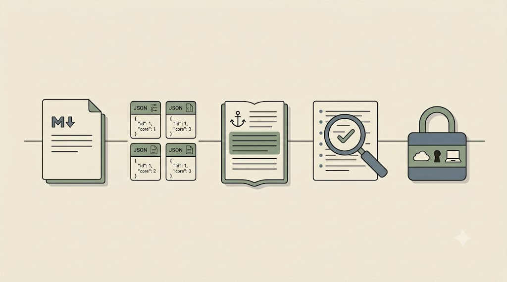

# Integracja, ewaluacja i zamknięcie

Pojedyncze techniki dają wartość dopiero złożone w *powtarzalny, bezpieczny* przepływ, który zostanie z Tobą po szkoleniu. Ten rozdział domyka łuk i opisuje, jak oceniamy efekty.

## Spięcie łuku w jeden protokół

Całe szkolenie to jeden ciąg: **prompt → kontekst i dane → nadzorowany agent**. Osobisty protokół pracy z AI łączy cztery elementy w jedną stronę:

- **szablon promptu** (cztery warstwy),
- **karta klatki prywatności** (co lokalnie, co w chmurze, czego nie powierzam AI),
- **checklista weryfikacji halucynacji** (kotwice + sprawdzenie próbki źródeł),
- **zasady doboru narzędzia**.

> **Zasada proporcjonalności.** Prosty prompt do prostego pytania; agent i RAG tylko tam, gdzie złożoność tego wymaga. Protokół ma *upraszczać* decyzje, nie komplikować.

Pomocna jest mapa „pięciu stacji" jednego przepływu — każda to krok z wcześniejszych rozdziałów, spięty protokołem:

| Stacja | Co robisz | Decyzja z protokołu |
|---|---|---|
| 1. Czysty `.md` | konwertujesz zanonimizowany PDF (lub bierzesz gotowe streszczenie) | „gdzie trafią dane?" → tylko materiał jawny |
| 2. Struktura | przepisujesz metadane do `dane.json` / wiersza matrycy | dane mają strukturę → JSON / matryca |
| 3. Synteza zakotwiczona | prosisz o akapit **wyłącznie** z matrycy, z numerem wiersza-źródła | format + „luki = brak danych" |
| 4. Kontrola | przepuszczasz wynik przez checklistę halucynacji, sprawdzasz próbkę cytowań | checklista weryfikacji |
| 5. Decyzja środowiskowa | nazywasz, czy materiał wolno było puścić w chmurę, czy wymagał lokalnego LLM | karta klatki prywatności |

<!-- ════════ GRAFIKA [G27] ════════
TYP: GENERATOR (pięć stacji przepływu)
PLIK: images/g27-piec-stacji.png
PROMPT: "Pięć małych stacji połączonych od lewej do prawej jedną cienką, ciągłą linią — schludna ścieżka
montażowa; każda stacja to drobny, odrębny piktogram: czysty dokument (czysty markdown), siatka kart z
etykietami (struktura / JSON), zakotwiczony akapit (synteza z kotwicą), lupa z listą kontrolną (kontrola
halucynacji) i mała obudowa/kłódka wybierająca chmurę-lub-laptop (decyzja środowiskowa). Sens: jeden
powtarzalny przepływ złożony z wcześniejszych kroków. Styl flat, cienka precyzyjna kreska, paleta japandi:
matowe kremowe tło #F1ECE3, akcenty szałwiowa zieleń #8A9A82 i błękit łupkowy #6B7B8C, atrament #26211C; bez
gradientów i winiet, 16:9, bez tekstu." -->

{fig-align="center" width="100%"}

::: {.callout-tip title="Ćwiczenie i artefakt"}
Złóż `PROTOKOL-AI.md` (`kurs-pe/szablony/PROTOKOL-AI-szablon.md`) z fragmentów zbieranych od początku kursu i wykonaj **jeden pełny mały przepływ** na własnym materiale przez pięć stacji wyżej. Uporządkuj folder `portfolio/` wg `kurs-pe/szablony/README-portfolio-szablon.md`. Artefakt: kompletne portfolio + osobisty protokół.
:::

## Ewaluacja — portfolio

Ocena jest **formująca**, nie rankingowa — chodzi o informację zwrotną i o to, by każdy wyszedł z działającym protokołem. Trzy kryteria odpowiadają trzem filarom z pierwszego rozdziału.

| Kryterium | Wskaźniki spełnienia |
|---|---|
| **Jasność zadania (prompt)** | struktura 4-warstwowa · ślad iteracji v1→v3 · trafny format (Markdown/XML/JSON) |
| **Ochrona danych (klatka prywatności)** | mapa ryzyka · karta chmura/lokalnie · brak danych wrażliwych · minimalizacja |
| **Kontrola halucynacji** | prompty zakotwiczające · cytaty-kotwice · weryfikacja próbki źródeł |

Skala dla każdego kryterium: *spełnia w pełni / spełnia częściowo / wymaga dopracowania*. Warunek zaliczenia: co najmniej „spełnia częściowo" w każdym kryterium, kompletny `PROTOKOL-AI.md` oraz dołączone **oświadczenie o użyciu AI** (`ai-disclosure-szablon.md`) opisujące, co w portfolio zrobił człowiek, a co narzędzie.

## Jeden nawyk na koniec

Zamykamy tym, czym otworzyliśmy: to szkolenie nie jest o tym, żeby „używać wszystkiego", lecz żeby mieć **protokół i trzy odruchy**. Zacznij od jednego nawyku i rozbudowuj resztę stopniowo.

> Zanim wciśniesz Enter — zapytaj: *„gdzie trafiają te dane i czym to zakotwiczę?"*

<!-- ════════ GRAFIKA [G08] ════════
TYP: GENERATOR (ilustracja zamykająca)
PLIK: images/g08-zamkniecie.png
PROMPT: "Spokojna, optymistyczna ilustracja: badacz i asystent-AI pracujący ramię w ramię nad
uporządkowanym warsztatem wiedzy (markdown, graf, ikona lokalnego serwera). Symbolika kontroli i
zaufania. Styl flat, paleta japandi: matowe kremowe tło #F1ECE3, akcenty szałwiowa zieleń #8A9A82 i błękit łupkowy #6B7B8C, atrament #26211C; bez gradientów i winiet, 16:9, bez tekstu." -->

{fig-align="center" width="100%"}

## Aneks — źródła i aktualność

Stan narzędzi opisany w tym podręczniku to **lipiec 2026**. Nazwy modeli i okna kontekstowe zmieniają się w miesiącach, nie latach — sprawdź je u producentów (OpenAI, Anthropic, Google) i na stronach narzędzi.

- Anthropic — *Effective context engineering for AI agents*; *Steering Claude Code: skills, hooks, subagents and more*.
- Deep research i jego granice — Aaron Tay, *Deep Research, Shallow Agency* (2025).
- Praktyka pracy z agentem — E. Beam, E. Aslim, *Thinking With Agents* (2026); Susam Pal, *Three Inverse Laws of AI* (2026).
- Okna kontekstowe 2026 · narzędzia literaturowe (Elicit, Consensus, Scite, Connected Papers, Litmaps, Research Rabbit).
- Lokalne LLM — Ollama, LM Studio; wymagania sprzętowe i kwantyzacja.
- Konwersja PDF→Markdown — pymupdf4llm, Docling, marker, Pandoc.
- Ochrona danych / RODO — decyzja TSUE 2025 ws. danych pseudonimizowanych; wytyczne IOD/DPO uczelni (nie stanowią porady prawnej).

> **Zastrzeżenie.** Liczby i nazwy modeli pochodzą z materiałów branżowych o różnej wiarygodności i szybko się dezaktualizują. Traktuj je jako punkt wyjścia do weryfikacji, nie jako pewnik. Odniesienia prawne nie są poradą prawną — weryfikuj z IOD/DPO uczelni.
